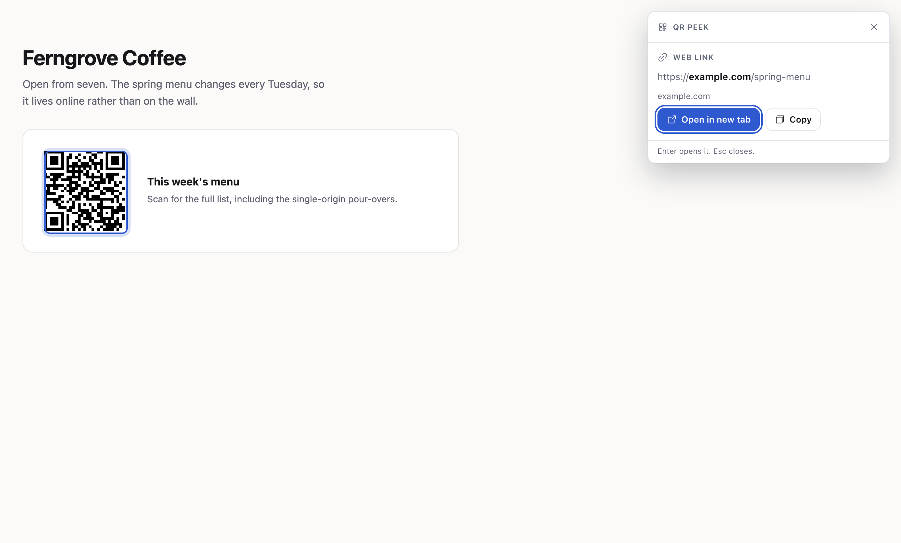
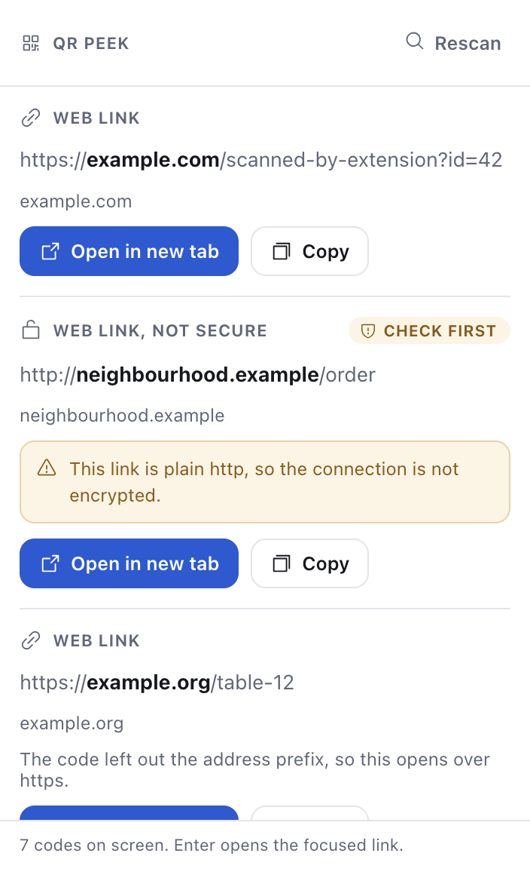
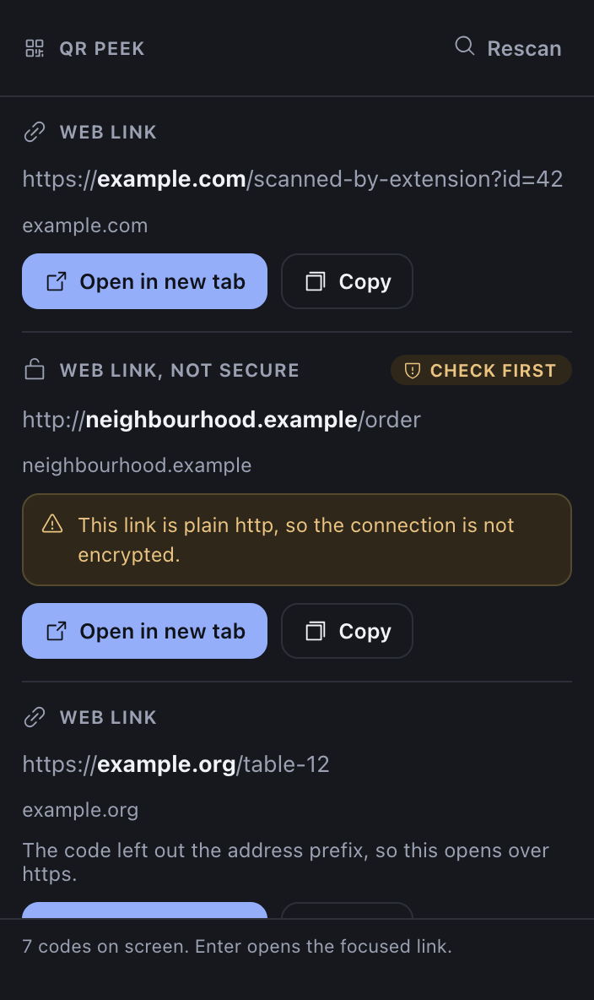

<h1 align="center">QR Peek</h1>

<p align="center">
  Reads the QR codes on the page you are looking at, tells you what each one contains,<br>
  and opens it only when you say so.
</p>

<p align="center">
  <a href="LICENSE"></a>
  
  
</p>

<p align="center">
  
</p>

You cannot point a phone at your own screen. QR Peek reads the code where it already is: press the
shortcut or click the icon, see exactly where it goes, then decide.

---

## What it does

| Trigger | What happens |
| --- | --- |
| Toolbar icon | Popup scans the visible tab and lists every code it finds |
| `⇧⌘Y` (macOS) / `Ctrl+Shift+Y` | Scans without opening the popup and shows the result in the page itself |
| Right-click an image, **Scan QR code in this image** | Reads that image's own pixels, which is far better input than a screenshot of them |

**Enter** opens the first link, **Esc** closes. When several codes are on screen, the in-page panel
outlines each one where it sits, so you can tell which card belongs to which code.

It reads web links, Wi-Fi networks, contact cards, calendar events, payment requests, two-factor
setup codes, email, phone, SMS, locations and plain text. Rotated and inverted codes are fine, as
is a 64px code in a 4K screenshot.

<table>
  <tr>
    <td width="50%"></td>
    <td width="50%"></td>
  </tr>
  <tr>
    <td align="center"><em>Popup, light</em></td>
    <td align="center"><em>Popup, dark</em></td>
  </tr>
</table>

Both surfaces follow the browser theme; here is the in-page panel
[in dark](docs/screenshots/in-page-dark.png).

## Nothing opens without a click

A QR code is attacker-controlled input. A poster, a sticker or any page can encode whatever it
likes, and you cannot read a QR code with your eyes. So every result is shown first and labelled.

**Flagged, but still openable** — you get the reason and the decision:

- plain `http`, so the connection is not encrypted;
- a domain that is not plain Latin text, shown with its real punycode form, because `аpple.com`
  with a Cyrillic "а" looks identical to the real thing;
- credentials before the `@`, the classic way to dress a link up as a brand you know;
- a bare IP address, a non-standard port, or a shortener hiding where it actually goes.

**Never opened at all:** `javascript:`, `data:`, `vbscript:`, `file:`, `blob:`, `jar:`,
`view-source:` and browser-internal schemes. The card shows the text and a Copy button, and that
is all.

**Shown but never acted on:** Wi-Fi networks (open ones are flagged), contact cards, calendar
events, `mailto:`, `tel:`, `sms:`, `geo:`, payment requests such as `bitcoin:` and `upi:`, and
`otpauth:` two-factor codes, which carry a login secret and say so plainly.

The domain that actually decides where you land is the one in bold, so
`https://paypal.com.evil.example/login` reads correctly at a glance.

Codes that leave out `https://` are common, because the shorter encoding fits more data.
`example.org/table-12` opens over https and the card says that is what happened. Ordinary prose
never turns into a link: the last label has to be a country code, a gTLD the extension knows, or
carry a path.

When the background is asked to open a URL it classifies it again rather than trusting the
message, so a compromised page cannot forge a navigation.

## Install

Nothing is published to the extension stores yet, so load it unpacked. From the project folder:

```sh
npm install
npm run build
```

### Chrome, Brave, Edge

1. Open `chrome://extensions` (Brave: `brave://extensions`, Edge: `edge://extensions`).
2. Turn on **Developer mode**, top right.
3. Click **Load unpacked**.
4. Select the **`dist/chromium`** folder. Not the repository root, and not `dist` — the folder
   that contains `manifest.json`.
5. Click the puzzle-piece icon in the toolbar and **pin** QR Peek.

After changing any code, run `npm run build` and press the reload arrow on the extension card.

### Safari

Safari needs a wrapper app, which needs full Xcode. Command Line Tools alone is not enough.

```sh
npm run build
xcrun safari-web-extension-converter dist/safari --macos-only --project-location safari-app
```

Run the generated project once, then enable the extension in Safari, Settings, Extensions.
Safari 16.4 or newer. This path builds but has not been verified on a real install.

### Changing the shortcut

`chrome://extensions/shortcuts`.

## Try it

```sh
open docs/demo/index.html
```

A page with one code on it. Press `⇧⌘Y`, or click the icon.

There is a busier page under `e2e/site/index.html` after `npm run test:e2e` has generated it:
six codes, one per risk class.

## Permissions

`activeTab`, `scripting`, `contextMenus`, `storage`, and **no host permissions**. `activeTab` is
granted per action by your click, shortcut or menu choice, so the extension cannot read a page
you have not pointed it at.

Nothing is collected, stored or sent anywhere, and the extension makes no network requests of its
own. See [PRIVACY.md](PRIVACY.md).

## How it works

`tabs.captureVisibleTab` produces a PNG of the visible tab, `OffscreenCanvas` turns it into
pixels, and ZXing reads every code in one pass. A full-screen frame takes roughly 50 to 200ms.

The WebAssembly binary ships inside the extension, so scanning works offline and nothing is
fetched from a CDN. It runs in the service worker, which is why the manifest carries
`'wasm-unsafe-eval'` in its extension-pages CSP. Content scripts never decode anything: they
render the result panel and, for the right-click path, hand back the clicked image's pixels.

An earlier version used jsQR with hand-rolled tiling, downscaling and masking passes to work
around its one-code-per-call limit. It was about ten times slower and found two of six codes on a
page holding six, because jsQR's finder-pattern grouping breaks once several codes share a frame.
The tests for that case are still in `tests/decode.test.ts`.

```
src/lib/decode.ts      ZXing wrapper: a frame in, codes and their positions out
src/lib/payload.ts     decoded text -> typed payload, risk level, plain-language warnings
src/lib/resultCard.ts  card markup and styles, shared by the popup and the in-page panel
src/lib/icons.ts       generated from @phosphor-icons/core
src/lib/capture.ts     tab capture and rasterising
src/background/        triggers, orchestration, the only place that opens a tab
src/content/overlay.ts shadow-DOM panel and the on-page outlines
src/popup/             toolbar UI
e2e/                   real-browser test harness
```

## Development

```sh
npm run dev          # esbuild watch, both targets
npm run build        # production build
npm test             # unit tests: decoder, robustness, payload classification, card rendering
npm run coverage     # coverage for the modules unit tests can reach
npm run typecheck    # tsc --noEmit
npm run test:e2e     # real browser run, see below
npm run package      # zip a build for an extension store
npm run icons        # regenerate the PNG icon set and src/lib/icons.ts
npm run screenshots  # regenerate the images in this README
```

`npm run test:e2e` builds the extension, serves a page carrying one code per risk class, launches
a real browser with a throwaway profile, loads the extension over the DevTools protocol, and
checks the whole path: every code decodes, the popup renders one card each, Open appears only for
web links, the blocked payload is labelled, the lookalike domain shows its punycode form, the
panel mounts in a closed shadow root and outlines the code, a forged `javascript:` message opens
nothing, and a restricted page explains itself. Add `-- --browser=brave` or `-- --browser=edge`
to run it elsewhere.

Nothing can fire `chrome.commands` or `chrome.contextMenus` programmatically, so the keyboard
shortcut and the right-click menu would otherwise be tested only in pieces. The suite runs a
**test build** (`npm run build -- --test`) whose background exposes what those two listeners call,
and whose panel mirrors its decoded text onto the host element so a closed shadow root can still
be inspected. Both are compiled out of a normal build, and `scripts/build.mjs` reads the shipped
bundle back to confirm it, rather than trusting the flag.

The test build also carries `host_permissions: ["<all_urls>"]`, because driving a browser over
the DevTools protocol cannot produce the real user click that grants `activeTab`. The shipped
build keeps the minimal permission set.

## What it can read, measured

These are the boundaries where decoding stops working, found by sweeping each kind of damage
until it failed. They are pinned from both sides in `tests/robustness.test.ts`, on a 420px code
at error correction level H.

| Damage | Still reads | Gives up |
| --- | --- | --- |
| Blur | sigma 6 | sigma 8 |
| A corner covered | 45% of the width | 50% |
| A logo through the middle | 35% of the width | 40% |
| Washed-out contrast | 10% of the original | 6% |
| Scaled down and back up | to 10% and back | to 8% |
| Seen at an angle | skew 0.3 | skew 0.4 |
| JPEG compression | quality 5 | - |
| Noise over the image | a quarter of it | 30% |
| Part of the code cut off | 5% of the width | 10% |
| Code size in a 2560x1440 screenshot | 50px across | 40px |

Standard QR, Micro QR and rMQR are all read, rotated or inverted, several at once in one frame.

## Known limits

- Browsers block extensions on `chrome://`, `edge://`, `brave://`, the extension gallery and the
  built-in PDF viewer. The popup says so rather than failing silently.
- Only the visible part of the tab is scanned. Scroll the code into view and rescan.
- A cross-origin image without CORS headers cannot be read pixel-for-pixel, so the right-click
  path falls back to cropping the screenshot around that image.
- Safari builds but is unverified, because the converter needs full Xcode. Edge is untested; it
  runs the same Chromium build.

## Contributing

See [CONTRIBUTING.md](CONTRIBUTING.md). Security reports go through
[SECURITY.md](SECURITY.md), privately rather than as an issue.

## Licence

[MIT](LICENSE).
